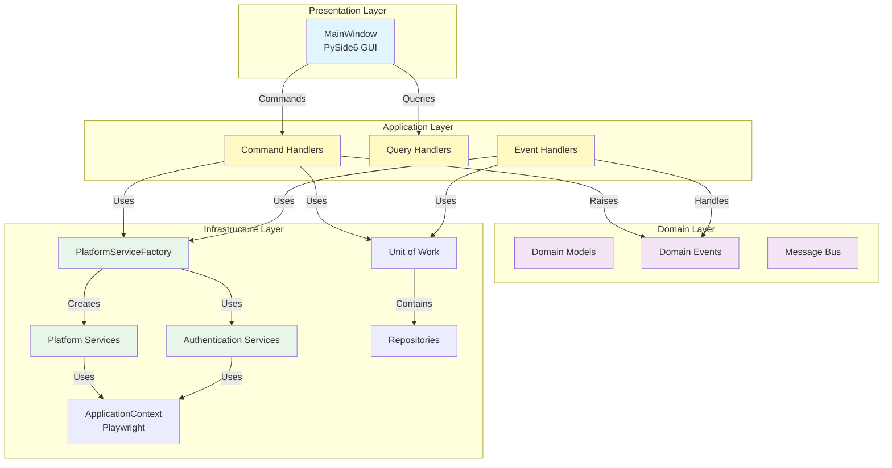
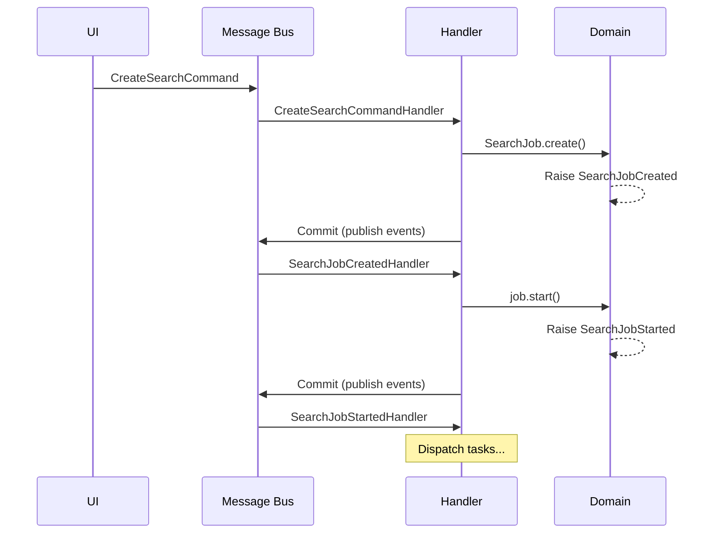
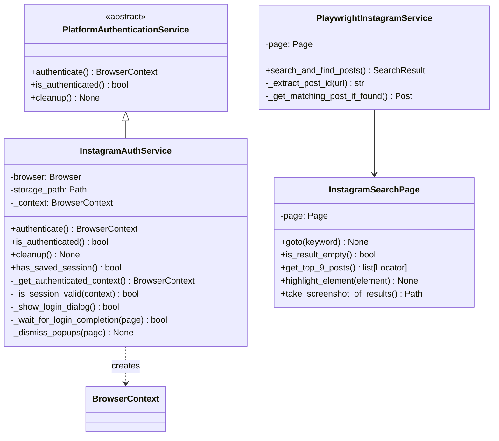
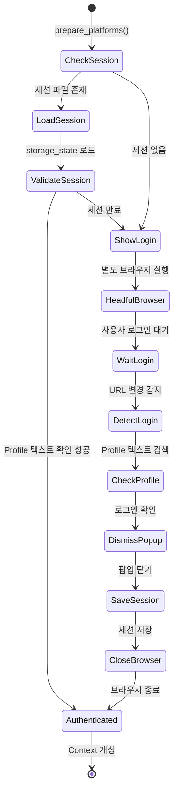
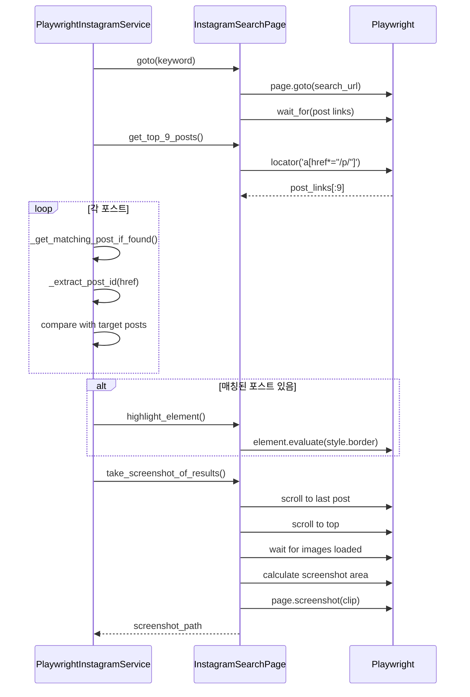
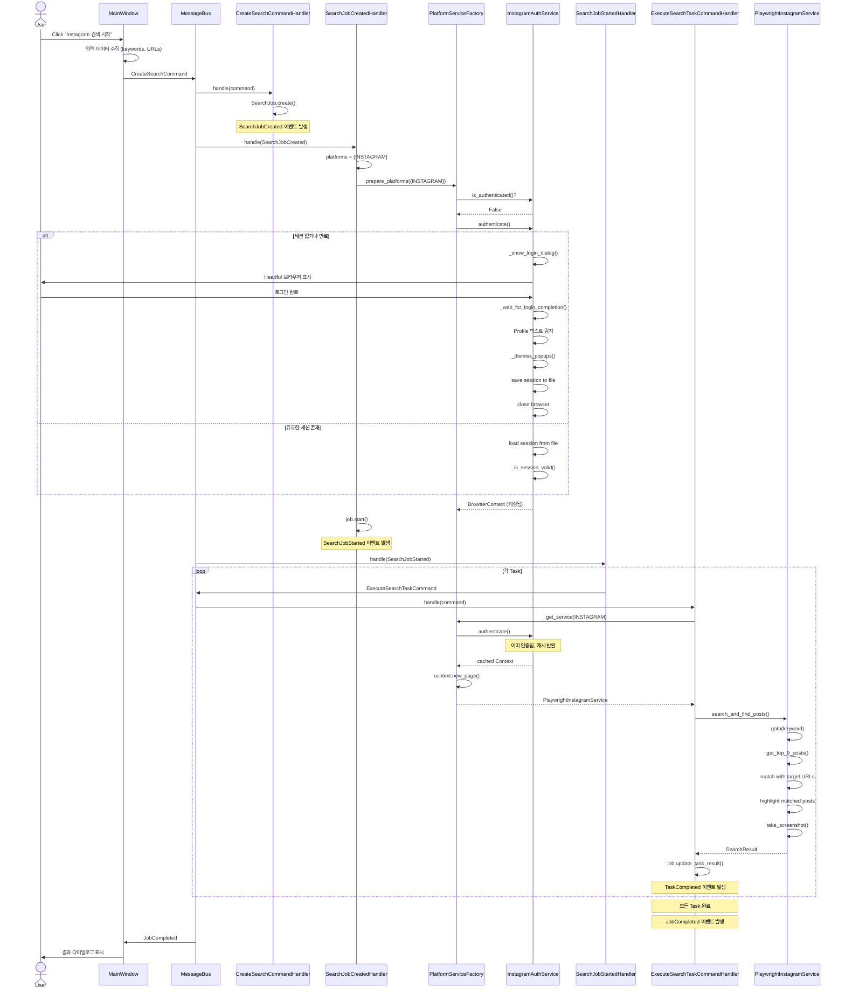

# Viral Marketing Reporter - Architecture Documentation

## Table of Contents
1. [프로젝트 개요](#프로젝트-개요)
2. [전체 아키텍처](#전체-아키텍처)
3. [Instagram 플랫폼 상세 분석](#instagram-플랫폼-상세-분석)
4. [실행 플로우](#실행-플로우)
5. [주요 컴포넌트](#주요-컴포넌트)
6. [확장 가이드](#확장-가이드)

---

## 프로젝트 개요

### 목적
바이럴 마케팅을 위한 키워드 검색 및 포스트 매칭 자동화 도구

### 주요 기능
- 네이버 블로그, Instagram 등 여러 플랫폼 지원
- 키워드 검색 후 상위 N개 포스트에서 특정 URL 매칭
- 매칭된 포스트 하이라이트 및 스크린샷 촬영
- GUI를 통한 사용자 친화적 인터페이스

### 기술 스택
- **언어**: Python 3.13
- **GUI**: PySide6 (Qt)
- **브라우저 자동화**: Playwright
- **비동기 처리**: asyncio + qasync
- **아키텍처 패턴**: Clean Architecture + DDD + CQRS + Event-Driven

---

## 전체 아키텍처

### 계층 구조



### 주요 패턴

#### 1. Clean Architecture
- **관심사의 분리**: 각 계층이 독립적으로 동작
- **의존성 규칙**: 외부에서 내부로만 의존 (Domain이 중심)
- **테스트 용이성**: 각 계층을 독립적으로 테스트 가능

#### 2. Domain-Driven Design (DDD)
- **엔티티**: `SearchJob`, `SearchTask`
- **값 객체**: `Keyword`, `Post`, `Screenshot`
- **도메인 이벤트**: `SearchJobCreated`, `TaskCompleted`, `JobCompleted`
- **애그리게이트**: `SearchJob`이 `SearchTask`들을 관리

#### 3. CQRS (Command Query Responsibility Segregation)
- **Command**: 상태 변경 작업 (CreateSearchCommand, ExecuteSearchTaskCommand)
- **Query**: 데이터 조회 작업 (GetJobResultQuery)
- **분리 이유**: 복잡한 쓰기 로직과 단순한 읽기 로직을 독립적으로 최적화

#### 4. Event-Driven Architecture


---

## Instagram 플랫폼 상세 분석

### Instagram vs 기본 플랫폼 차이점

| 구분 | 네이버 블로그 | Instagram |
|------|--------------|-----------|
| **인증** | 불필요 | 필요 (로그인) |
| **브라우저 모드** | Headless | Headful (로그인 시), Headless (검색 시) |
| **Viewport** | 1920x1080 | 1280x1080 |
| **세션 관리** | 없음 | 파일 기반 세션 저장 |
| **Context** | 공유 (default) | 독립적 (인증 전용) |

### Instagram 컴포넌트 구조



### Instagram 인증 프로세스



### Instagram 검색 프로세스



---

## 실행 플로우

### 전체 플로우 (Instagram 포함)



### 세부 플로우 분석

#### 1. Job 생성 단계 (Commands & Events)
```
CreateSearchCommand
  → CreateSearchCommandHandler
    → SearchJob.create() (domain)
      → SearchJobCreated 이벤트 발생
        → UoW commit (이벤트 publish)
```

#### 2. 인증 단계 (Instagram 특화)
```
SearchJobCreated 이벤트
  → SearchJobCreatedHandler
    → factory.prepare_platforms({INSTAGRAM})
      → InstagramAuthService.authenticate()
        → _get_authenticated_context()
          → [세션 없음] _show_login_dialog()
            → Headful 브라우저 실행
            → 사용자 로그인 대기
            → Profile 텍스트 감지
            → 팝업 자동 닫기
            → 세션 파일 저장
            → 브라우저 즉시 종료
          → [세션 있음] _is_session_valid()
            → Instagram 홈페이지 방문
            → Profile 텍스트 존재 확인
          → BrowserContext 반환 및 캐싱
    → job.start()
      → SearchJobStarted 이벤트 발생
```

#### 3. Task 실행 단계
```
SearchJobStarted 이벤트
  → SearchJobStartedHandler
    → for each task: ExecuteSearchTaskCommand
      → ExecuteSearchTaskCommandHandler
        → factory.get_service(INSTAGRAM)
          → AuthService.authenticate() [캐시된 Context 반환]
          → context.new_page()
          → PlaywrightInstagramService 생성
        → service.search_and_find_posts()
          → InstagramSearchPage.goto(keyword)
            → page.goto(search_url, wait_until="load")
            → wait_for(post links visible)
          → get_top_9_posts()
            → locator('a[href*="/p/"], a[href*="/reel/"]').all()[:9]
          → _get_matching_post_if_found() (병렬 처리)
            → _extract_post_id(href)
            → 타겟 포스트 ID와 비교
          → [매칭 있음] highlight_element()
          → take_screenshot_of_results()
            → scroll to last post (lazy loading)
            → scroll to top
            → wait for images loaded (naturalWidth > 0)
            → calculate screenshot area (dynamic width)
            → page.screenshot(clip)
        → job.update_task_result()
          → TaskCompleted 이벤트 발생
```

#### 4. 완료 단계
```
모든 Task 완료
  → job.check_if_completed()
    → JobCompleted 이벤트 발생
      → MainWindow.handle_job_completed()
        → ResultsDialog 표시
```

---

## 주요 컴포넌트

### 1. Domain Layer

#### SearchJob (Aggregate Root)
```python
class SearchJob:
    job_id: uuid.UUID
    tasks: list[SearchTask]
    status: JobStatus

    @staticmethod
    def create(job_id, tasks) -> SearchJob:
        # SearchJobCreated 이벤트 발생

    def start() -> None:
        # SearchJobStarted 이벤트 발생

    def update_task_result(task_id, result) -> None:
        # TaskCompleted 이벤트 발생

    def check_if_completed() -> None:
        # JobCompleted 이벤트 발생 (모든 Task 완료 시)
```

**역할**:
- Task들의 생명주기 관리
- 도메인 이벤트 발생
- 비즈니스 규칙 적용

#### SearchTask (Entity)
```python
class SearchTask:
    task_id: uuid.UUID
    index: int
    keyword: Keyword
    blog_posts_to_find: list[Post]
    platform: Platform
    status: TaskStatus
    result: SearchResult | None
    error_message: str | None
```

**역할**:
- 개별 검색 작업 표현
- 상태 추적

### 2. Application Layer

#### Command Handlers
```python
class CreateSearchCommandHandler:
    async def handle(command):
        # SearchJob 생성
        # UoW에 저장 → SearchJobCreated 발생

class ExecuteSearchTaskCommandHandler:
    async def handle(command):
        # Factory에서 서비스 가져오기
        # 검색 실행
        # 결과 업데이트 → TaskCompleted 발생
```

#### Event Handlers
```python
class SearchJobCreatedHandler:
    async def handle(event):
        # 플랫폼 사전 준비 (인증)
        # job.start() → SearchJobStarted 발생

class SearchJobStartedHandler:
    async def handle(event):
        # 각 Task에 대해 ExecuteSearchTaskCommand 발행

class TaskCompletedHandler:
    async def handle(event):
        # job.check_if_completed()
        # 모든 Task 완료 시 JobCompleted 발생
```

### 3. Infrastructure Layer

#### PlatformServiceFactory
```python
class PlatformServiceFactory:
    _service_classes: dict[Platform, Type[SearchPlatformService]]
    _auth_services: dict[Platform, PlatformAuthenticationService]

    def register_service(platform, service_class):
        # 서비스 클래스 등록

    def register_auth_service(platform, auth_service):
        # 인증 서비스 등록

    async def prepare_platforms(platforms: set[Platform]):
        # Job 시작 전 인증 수행
        for platform in platforms:
            if platform in self._auth_services:
                await self._auth_services[platform].authenticate()

    async def get_service(platform) -> SearchPlatformService:
        # 인증 서비스가 있으면 인증된 Context 사용
        # 없으면 기본 Context 사용
        # Page 생성 및 Service 인스턴스화
```

**핵심 역할**:
- 플랫폼별 서비스 생성 관리
- 인증이 필요한 플랫폼의 사전 인증 처리
- 리소스 생명주기 관리

#### InstagramAuthService
```python
class InstagramAuthService(PlatformAuthenticationService):
    browser: Browser
    storage_path: Path
    _context: BrowserContext | None

    # PlatformAuthenticationService 인터페이스 구현
    async def authenticate() -> BrowserContext:
        if self._context is None:
            self._context = await self._get_authenticated_context()
        return self._context

    def is_authenticated() -> bool:
        return self._context is not None

    async def cleanup():
        if self._context:
            await self._context.close()

    # Instagram 전용 메서드들
    async def _get_authenticated_context() -> BrowserContext:
        # 1. 세션 파일 확인
        if has_saved_session():
            context = load_session_and_create_context()
            if _is_session_valid(context):
                return context
            else:
                await context.close()

        # 2. 로그인 필요
        success = await _show_login_dialog()
        if success:
            return create_context_with_new_session()
        else:
            raise Exception("로그인 실패")

    async def _show_login_dialog() -> bool:
        # Headful 브라우저 실행
        # 사용자 로그인 대기
        # _wait_for_login_completion()
        # 세션 저장
        # 브라우저 즉시 종료

    async def _wait_for_login_completion(page) -> bool:
        # URL 변경 대기 (/accounts/login 벗어남)
        # Profile 텍스트 감지 (regex)
        # _dismiss_popups()

    async def _is_session_valid(context) -> bool:
        # Instagram 홈페이지 방문
        # Profile 텍스트 존재 확인
```

**핵심 역할**:
- 세션 파일 관리 (저장/로드)
- 로그인 다이얼로그 표시 및 완료 감지
- 세션 유효성 검증

#### PlaywrightInstagramService
```python
class PlaywrightInstagramService(SearchPlatformService):
    page: Page

    async def search_and_find_posts(
        index, keyword, posts_to_find, output_dir
    ) -> SearchResult:
        search_page = InstagramSearchPage(self.page)

        # 1. 검색 페이지 이동
        await search_page.goto(keyword.text)

        # 2. 상위 9개 포스트 가져오기
        top_9_posts = await search_page.get_top_9_posts()

        # 3. 매칭 작업 (병렬)
        matching_results = await asyncio.gather(*[
            self._get_matching_post_if_found(post_link, posts_to_find)
            for post_link in top_9_posts
        ])

        # 4. 하이라이트
        if found_posts:
            await asyncio.gather(*[
                search_page.highlight_element(element)
                for element in elements_to_highlight
            ])

        # 5. 스크린샷 (무조건)
        screenshot_path = await search_page.take_screenshot_of_results(
            index, keyword.text, output_dir
        )

        return SearchResult(found_posts, Screenshot(screenshot_path))

    def _extract_post_id(url) -> str:
        # /p/ABC123/ or /reel/ABC123/ → ABC123

    async def _get_matching_post_if_found(post_link, posts_to_find) -> Post | None:
        # href 추출
        # 포스트 ID 비교
        # 매칭되면 Post 반환
```

#### InstagramSearchPage (Page Object Pattern)
```python
class InstagramSearchPage:
    page: Page

    async def goto(keyword: str):
        url = f"https://www.instagram.com/explore/search/keyword/?q={quote(keyword)}"
        await page.goto(url, wait_until="load")
        # 포스트 링크가 나타날 때까지 대기
        await page.locator('a[href*="/p/"]').first.wait_for(state="visible")

    async def get_top_9_posts() -> list[Locator]:
        post_links = await page.locator('a[href*="/p/"], a[href*="/reel/"]').all()
        return post_links[:9]

    async def highlight_element(element: Locator):
        await element.evaluate('element => { element.style.border = "5px solid red"; }')

    async def take_screenshot_of_results(index, keyword, output_dir) -> Path:
        top_9_posts = await self.get_top_9_posts()

        # 1. 마지막 포스트까지 스크롤 (lazy loading)
        await top_9_posts[-1].scroll_into_view_if_needed()
        await page.wait_for_timeout(2000)

        # 2. 최상단으로 스크롤
        await page.evaluate("window.scrollTo(0, 0)")
        await page.wait_for_timeout(2000)

        # 3. 이미지 로딩 대기
        await page.evaluate("""
            async () => {
                const images = document.querySelectorAll('img');
                for (const img of images) {
                    while (!img.complete || img.naturalWidth === 0) {
                        await new Promise(resolve => setTimeout(resolve, 100));
                    }
                }
            }
        """)

        # 4. 스크린샷 영역 계산
        boxes = [await post.bounding_box() for post in top_9_posts]
        first_row_boxes = [box for box in boxes if abs(box['y'] - boxes[0]['y']) < 20]
        rightmost_box = max(first_row_boxes, key=lambda box: box['x'] + box['width'])

        width = rightmost_box['x'] + rightmost_box['width'] - boxes[0]['x']
        height = boxes[-1]['y'] + boxes[-1]['height']

        # 5. Viewport 조정 (메시지 팝업 고려)
        await page.set_viewport_size({"width": 1280, "height": height + 100})

        # 6. 스크린샷
        clip = {
            "x": boxes[0]['x'] - 20,
            "y": 0,  # 키워드 포함
            "width": width + 40,
            "height": height
        }
        await page.screenshot(path=screenshot_path, clip=clip)

        return screenshot_path
```

### 4. Presentation Layer

#### MainWindow
```python
class MainWindow(QMainWindow):
    message_bus: MessageBus
    query_handler: GetJobResultQueryHandler
    current_job_id: uuid.UUID | None
    current_platform: Platform | None

    @asyncSlot()
    async def run_search(platform: Platform):
        # 1. 입력 데이터 수집 (keywords, URLs)
        # 2. TaskDTO 생성
        # 3. CreateSearchCommand 발행
        # 4. 버튼 상태 업데이트 (플랫폼별)

    @asyncSlot()
    async def handle_task_completed(event: TaskCompleted):
        # 프로그레스 바 업데이트

    @asyncSlot()
    async def handle_job_completed(event: JobCompleted):
        # 버튼 상태 복원
        # 결과 조회
        # ResultsDialog 표시
```

---

## 확장 가이드

### 새로운 플랫폼 추가하기

#### 1. 인증이 필요 없는 플랫폼 (예: YouTube)

```python
# 1. Platform Enum 추가
class Platform(Enum):
    NAVER_BLOG = "naver_blog"
    INSTAGRAM = "instagram"
    YOUTUBE = "youtube"  # 추가

# 2. Service 구현
class PlaywrightYouTubeService(SearchPlatformService):
    async def search_and_find_posts(self, index, keyword, posts_to_find, output_dir):
        # 구현
        pass

# 3. main.py에서 등록
factory.register_service(Platform.YOUTUBE, PlaywrightYouTubeService)

# 끝! 인증이 필요 없으므로 AuthService 등록 불필요
```

#### 2. 인증이 필요한 플랫폼 (예: Facebook)

```python
# 1. Platform Enum 추가
class Platform(Enum):
    FACEBOOK = "facebook"

# 2. AuthService 구현 (PlatformAuthenticationService 인터페이스)
class FacebookAuthService(PlatformAuthenticationService):
    def __init__(self, browser: Browser, storage_path: Path | None = None):
        self.browser = browser
        self.storage_path = storage_path or Path.home() / "Downloads" / "viral-reporter" / "facebook_session.json"
        self._context = None

    # 인터페이스 구현
    async def authenticate() -> BrowserContext:
        if self._context is None:
            self._context = await self._get_authenticated_context()
        return self._context

    def is_authenticated() -> bool:
        return self._context is not None

    async def cleanup():
        if self._context:
            await self._context.close()

    # Facebook 전용 메서드들
    async def _get_authenticated_context(self) -> BrowserContext:
        # 세션 로드/저장 로직
        # 로그인 다이얼로그 로직
        ...

# 3. Service 구현
class PlaywrightFacebookService(SearchPlatformService):
    async def search_and_find_posts(...):
        pass

# 4. main.py에서 등록
factory.register_service(Platform.FACEBOOK, PlaywrightFacebookService)
facebook_auth = FacebookAuthService(browser=context.browser)
factory.register_auth_service(Platform.FACEBOOK, facebook_auth)
```

### UI 버튼 추가

```python
# main_window.py
self.facebook_button = QPushButton("Facebook 검색 시작")
self.facebook_button.clicked.connect(lambda: self.run_search(Platform.FACEBOOK))
platform_button_layout.addWidget(self.facebook_button)

# run_search()와 handle_job_completed()에 분기 추가
if platform == Platform.FACEBOOK:
    self.facebook_button.setText("검색 중...")
    self.facebook_button.setEnabled(False)
    # 다른 버튼들 비활성화
```

---

## 트러블슈팅

### Instagram 로그인 실패
1. **증상**: 로그인 후에도 Profile 텍스트를 찾지 못함
2. **원인**: Instagram UI 변경으로 텍스트 패턴이 달라짐
3. **해결**: `auth_manager.py`의 `_wait_for_login_completion()` 정규식 수정

### 스크린샷 이미지 로딩 안됨
1. **증상**: 회색 플레이스홀더가 스크린샷에 찍힘
2. **원인**: lazy loading 대기 시간 부족
3. **해결**: `page_objects.py`의 대기 시간 증가 또는 `naturalWidth` 체크 강화

### 세션 만료 반복
1. **증상**: 매번 로그인 요구
2. **원인**: 세션 파일이 제대로 저장되지 않음 또는 Instagram이 세션 무효화
3. **해결**:
   - 세션 파일 권한 확인
   - Instagram 보안 설정 확인
   - `clear_session()` 후 재로그인

---

## 성능 최적화

### 병렬 처리
- Task들은 순차 실행 (각 Task가 브라우저 페이지 생성)
- 포스트 매칭은 병렬 처리 (`asyncio.gather`)
- 하이라이트 작업 병렬 처리

### 캐싱 전략
- **AuthContext**: Job 실행 중 재사용
- **세션 검증**: 첫 번째 Task에서만 수행
- **브라우저 인스턴스**: ApplicationContext에서 단일 인스턴스 유지

### 메모리 관리
- 각 Task 완료 후 Page 닫기 (`finally` 블록)
- Job 완료 후 AuthContext 유지 (다음 Job에서 재사용)
- 애플리케이션 종료 시 전체 cleanup

---

## 보안 고려사항

### 세션 파일
- **위치**: `~/Downloads/viral-reporter/instagram_session.json`
- **권한**: 사용자만 읽기/쓰기 가능하도록 설정
- **내용**: Cookies, localStorage 포함 (민감 정보)
- **주의**: 버전 관리 시스템에 포함하지 말것

### Headless vs Headful
- **로그인**: Headful 모드 (사용자가 직접 인증)
- **검색**: Headless 모드 (백그라운드 실행)
- **이유**: Instagram의 봇 감지 우회

---

## 테스트

### 수동 테스트
```bash
# Instagram 플랫폼 테스트
uv run viral-reporter-test-instagram

# 전체 애플리케이션 테스트
uv run viral-reporter
```

### 단위 테스트 작성 예시
```python
# tests/test_instagram_auth.py
@pytest.mark.asyncio
async def test_instagram_auth_service():
    mock_browser = Mock(spec=Browser)
    auth_service = InstagramAuthService(browser=mock_browser)

    assert not auth_service.is_authenticated()

    # authenticate() 호출 시 _get_authenticated_context가 호출되는지 확인
    with patch.object(auth_service, '_get_authenticated_context') as mock_auth:
        mock_context = Mock(spec=BrowserContext)
        mock_auth.return_value = mock_context

        context = await auth_service.authenticate()

        assert context == mock_context
        assert auth_service.is_authenticated()
```

---

## 참고 자료

- [Clean Architecture - Robert C. Martin](https://blog.cleancoder.com/uncle-bob/2012/08/13/the-clean-architecture.html)
- [Domain-Driven Design - Eric Evans](https://www.domainlanguage.com/ddd/)
- [Playwright Documentation](https://playwright.dev/python/)
- [PySide6 Documentation](https://doc.qt.io/qtforpython/)

---

**마지막 업데이트**: 2025-11-13
**작성자**: Claude (AI Assistant)
